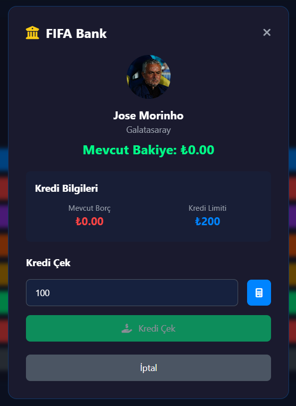
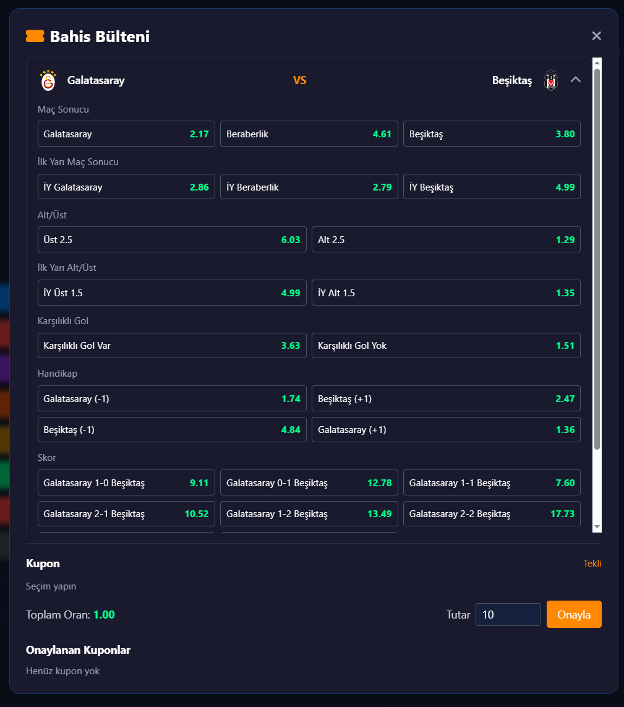
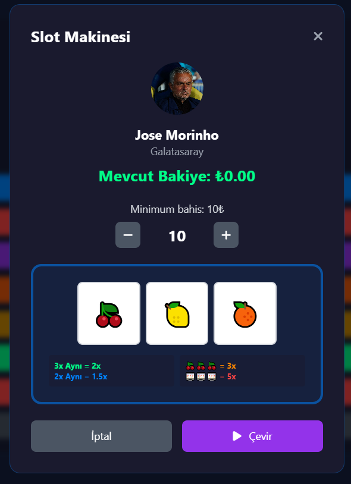
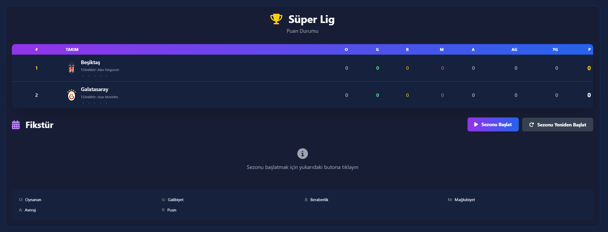
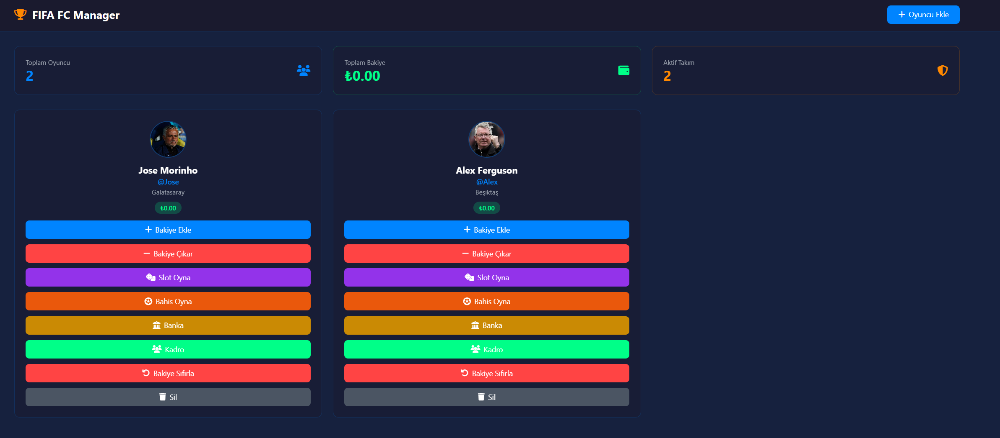
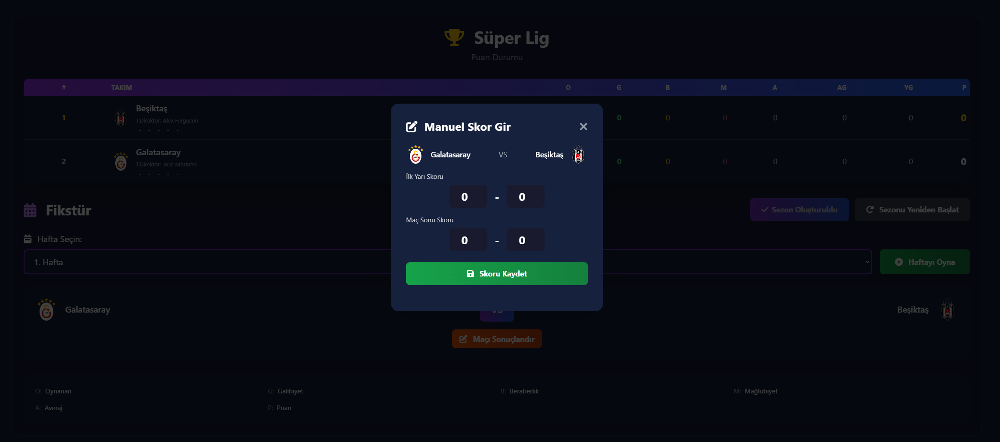

# FifaFC-Manager

## Overview

Ultimate Fifa FC Manager is a fun and interactive football management experience built as a browser-based web app. It is designed for FIFA lovers who want to enjoy a light, playful version of club management together with friends. Instead of being a heavy simulation platform, it focuses on the excitement of building a team, following a season, making financial decisions, and taking part in side activities such as betting and slot games.

The project combines football, strategy, and entertainment in one place. It gives users the feeling of running a club while also adding a social and competitive layer that makes it especially enjoyable for groups of friends.

## What the Project Is For

FifaFC-Manager is made to help FIFA players experience a challenge-style football management environment in a simple and entertaining way. Friends can compete side by side, manage their own teams, make decisions about money and transfers, and follow the results of a simulated season.

The app is not meant to replace a real football management system. Instead, it creates a casual and engaging experience where users can:

- build and manage a football squad,
- follow league standings and fixtures,
- make financial choices with in-game money,
- take loans from the bank,
- use their balance for transfers, bets, or other activities,
- and enjoy seasonal rewards such as win bonuses, championship bonuses, and match-based earnings.

## Core Experience

The main idea behind FC-Manager is simple: users manage a football club in a playful economy-driven environment.

At the start, players can create or organize their squad and track their overall club progress. As the season continues, they can follow match results, see how their team performs, and make decisions that affect their balance and future opportunities.

The app introduces a strong economic layer where users can:

- borrow money from the bank,
- use credit for transfers or other in-game needs,
- take part in betting-related activities,
- enjoy mini-game features such as slots,
- and receive rewards at the end of each season based on results and achievements.

This makes the project feel more like a football manager challenge with added entertainment and risk-reward mechanics.

## Main Features

### 1. League and Season Simulation
Users can follow a simulated football season with standings, fixtures, and match progression. The app makes it easy to see how results affect the league table and overall club success.

### 2. Bank and Credit System
One of the most important parts of the experience is the banking system. Players can withdraw credit from the bank, use that money for club-related spending, and manage their financial obligations over time.

### 3. Betting and Match-Related Activities
The project includes a betting-style layer where users can take part in activities tied to match outcomes and in-game earnings. This adds excitement and makes every result feel more meaningful.

### 4. Slot Game Module
A slot machine mini-game is included as a fun side feature. It gives users another way to interact with the app and enjoy a light casino-style experience alongside football management.

### 5. Transfer and Squad Economy
The app supports an economy where players can think about spending, earning, and managing resources. This makes the experience more dynamic and encourages strategic choices.

### 6. Seasonal Rewards
At the end of a season, users can receive rewards based on performance, such as championship bonuses and win-related earnings. This helps drive progression and keeps the experience engaging.

## Screenshots

The following images show the main parts of the experience in a compact visual order: bank, betting, and slot features.

| Bank | Bets | Slots |
|---|---|---|
|  |  |  |

| League / standings | Player / squad view | Match / results view |
|---|---|---|
|  |  |  |

## How the App Works

A typical flow in FC-Manager looks like this:

1. The user starts a season and follows the league progression.
2. They manage their team and monitor their club economy.
3. They can borrow money from the bank for transfers or other purposes.
4. They can participate in betting-related actions and enjoy the slot mini-game.
5. Their results and performance create rewards, bonuses, and a stronger sense of progression.

## Tech Stack

- HTML
- CSS
- JavaScript
- Tailwind CSS
- Font Awesome
- GSAP

## Project Structure

- index.html - main app entry point
- bank.js, casino.js, kadro.js, league.js, config.js - core gameplay and UI modules
- content/ - images, styles, and screenshots used by the app
- ../fixture/ - additional fixture and league-related view

## Installation and Usage

### Installation

FC-Manager is a frontend-only project, so there is no package installation or build process required.

1. Download or clone the project to your computer.
2. Open the project folder in your file explorer.
3. Make sure the files are kept together, especially the assets in the content and screenshots folders.

### How to Use

1. Open the main app by launching [index.html](index.html) in your browser.
2. From there, you can start exploring the football manager experience:
   - add or manage players,
   - follow the league and fixtures,
   - check your balance and banking options,
   - use the betting and slot features,
   - and enjoy the seasonal progression system.
3. If you want to view the standalone fixture/league page, open [../fixture/index.html](../fixture/index.html).

### Notes

- The app stores data locally in your browser using localStorage, so your current progress will remain available on the same browser/device.
- Since it is a lightweight demo, no server setup is required.
- For the best experience, use a modern browser such as Chrome, Edge, or Firefox.

## Summary

FifaFC-Manager is a lightweight and entertaining football management experience made for FIFA fans and friends who want to challenge each other in a fun and interactive way. It combines league progression, club economy, banking, betting, slot-style entertainment, and seasonal rewards into one simple web app that is easy to enjoy and easy to run.
